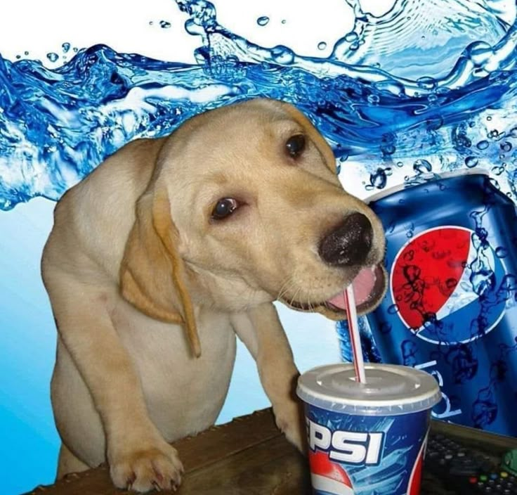
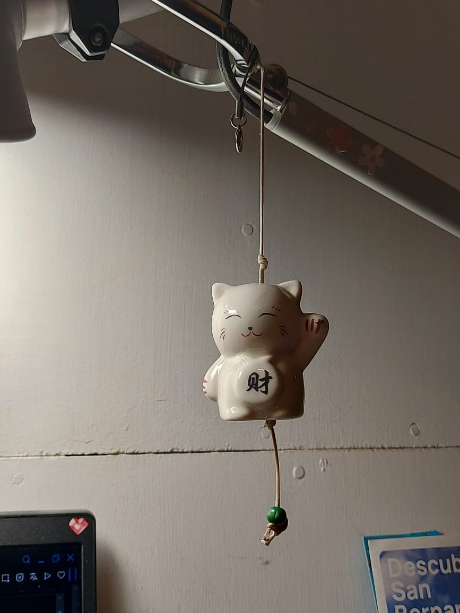
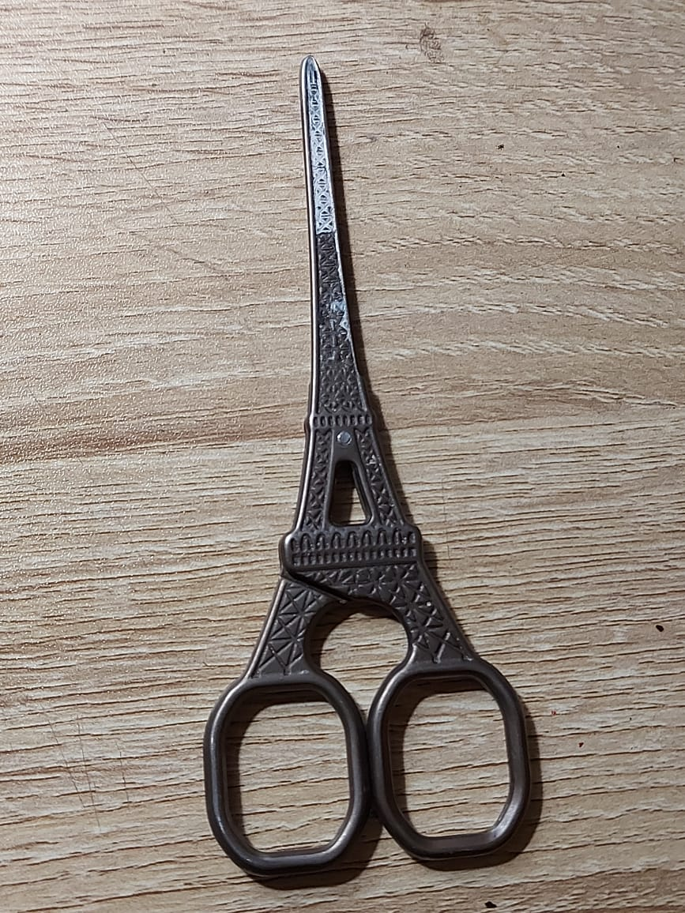
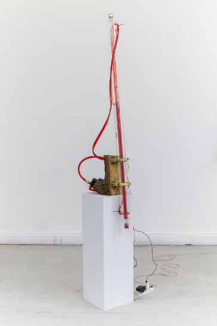
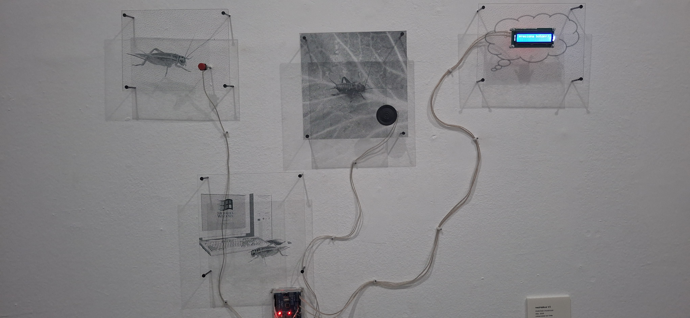

# Clase 01
## Apuntes de la clase
* Como poner una imagen:

* Subir la imagen
* Obtener la ruta: la ruta es solo el nombre de la imagen (ej: foto.png). O si está en una carpeta, carpeta/foto.png
* Escribir esto: 
* Y confirmar cambios

Charla de "la estética como cosmología"
En el texto se divide la forma de ver el mundo, como imagen y ejecución

## Tareas: 
* Escribir 10 cualidades sobre dos objetos
  

### Colgante de gato:
* Gato
* Chino
* Buena Suerte
* De cerámica
* Brillante
* Solido
* Tierno
* Blanco
* Tintineante
* Acompañante de escritorio

### Tijeras Torre Eiffel:
* Metal
* Pesadas
* Manchadas con pintura
* Filosas
* Sueltas
* Usadas
* Bonitas
* Resilientes
* Estéticas
* Color bronce antiguo

### Analizar las obras de Mateo Cereceda y Gabriela Inostroza en la muestra "Analog ROOT" de la galería de la universidad:

"Donante universal", Mateo Cereceda
En esta obra, un tubo de vidrio se llena y se vacía constantemente de un líquido similar a la sangre, en un ciclo continuo. Este movimiento activa el sentido del título: donar implica tanto retener como entregar. El sistema no representa un cuerpo, sino que demuestra una dinámica donde la energía y la materia circulan, produciendo una idea de intercambio.

"neoHaikus v2", Gabriela Inostroza
Aquí la obra divide al grillo, aparece en un entorno digital y en uno natural. Lo digital se asocia al pensamiento los haikus y lo natural a su canto. Ambas dimensiones se conectan mediante un botón que cuando se activa, hace que el grillo “cante” en forma de haikus.

